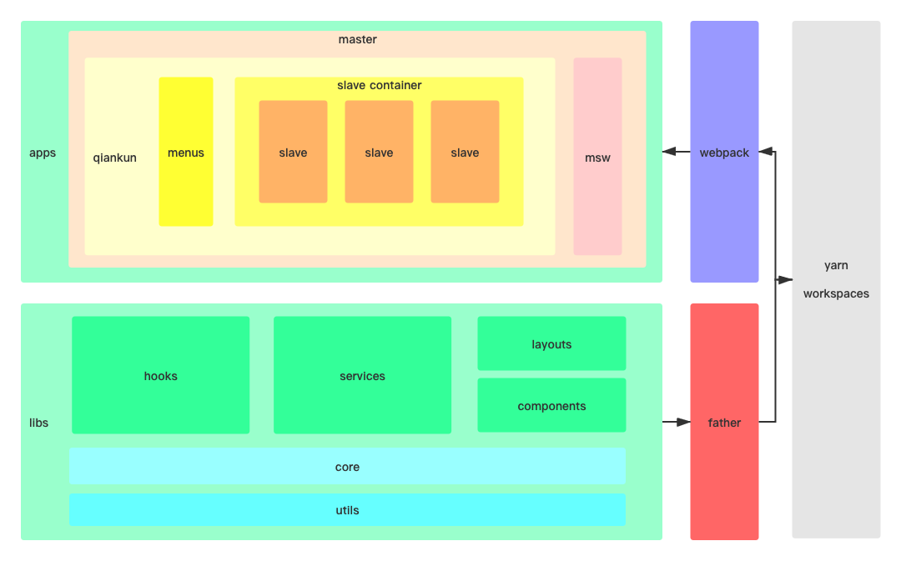

<h1 align="center">Ionia（艾欧尼亚）</h1>

<div align="center">
The rapid development framework for Micro Frontends
</div>
<br/>

English | [简体中文](./README-zh_CN.md)

## Features

- Global state synchronization
- Common component library
- Internationalization
- API Mock
- Authority control
- Dependency injection
- Aspect-oriented programming

## Usage

```bash
$ git clone git@github.com:ioniajs/ionia.git --depth=1 && cd ionia

$ yarn && yarn start
```

## Architecture



## Master application

```ts
import { isDev, MasterApplication } from "@ionia/libs";
import { IoniaApp } from "@ionia/libs/es/core/master-application";
import * as React from "react";
import { BrowserRouter as Router } from "react-router-dom";
import App from "./App";
import "./i18n";

if (isDev) {
  require("../mocks").default.start();
}

const apps: IoniaApp<{}>[] = [
  {
    name: "Dashboard",
    entry: "//localhost:7001",
    activeRule: "/dashboard",
  },
  {
    name: "CMS",
    entry: "//localhost:7002",
    activeRule: "/cms",
  },
  {
    name: "User",
    entry: "//localhost:7003",
    activeRule: "/user",
    hideInMenu: true,
  },
  {
    name: "Auth",
    entry: "//localhost:7004",
    activeRule: "/auth",
    hideInMenu: true,
  },
];

const lifeCycles = {
  beforeLoad: [
    (app: any): any => {
      console.log("[LifeCycle] before load %c%s", "color: green;", app.name);
    },
  ],
  beforeMount: [
    (app: any): any => {
      console.log("[LifeCycle] before mount %c%s", "color: green;", app.name);
    },
  ],
  afterUnmount: [
    (app: any): any => {
      console.log("[LifeCycle] after unmount %c%s", "color: green;", app.name);
    },
  ],
};

const initGlobalState = {
  title: "Ionia",
};

new MasterApplication(
  (
    <Router>
      <App />
    </Router>
  ),
  apps,
  "/dashboard",
  initGlobalState,
  lifeCycles
).start();
```

## Slave application

```ts
import { Application, isSlave } from "@ionia/libs";
import * as React from "react";
import { BrowserRouter as Router } from "react-router-dom";
import App from "./App";

const app = new Application(
  (
    <Router basename={isSlave ? "/dashboard" : "/"}>
      <App />
    </Router>
  )
);

app.start();

export async function bootstrap() {
  await app.bootstrap();
}

export async function mount(props: any) {
  await app.mount(props);
}

export async function unmount(props: any) {
  await app.unmount(props);
}
```

## Support

We sincerely invite you to participate in the ecological construction of Ionia (e.g. star)
