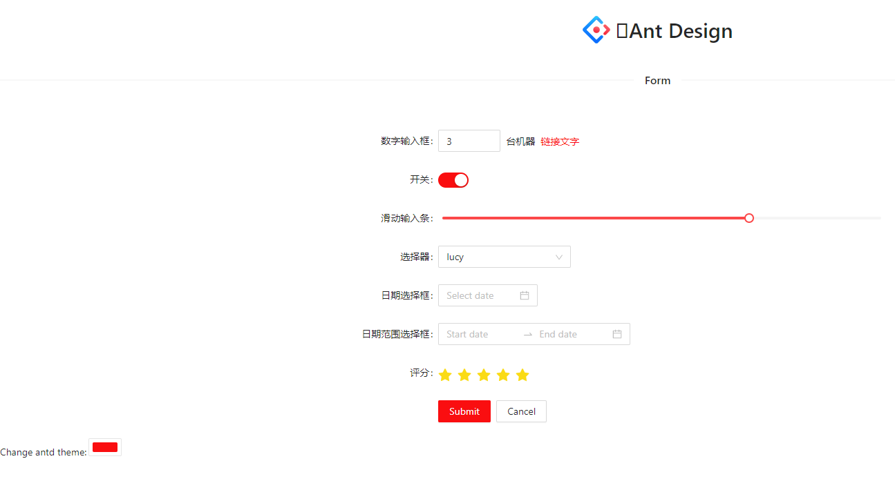
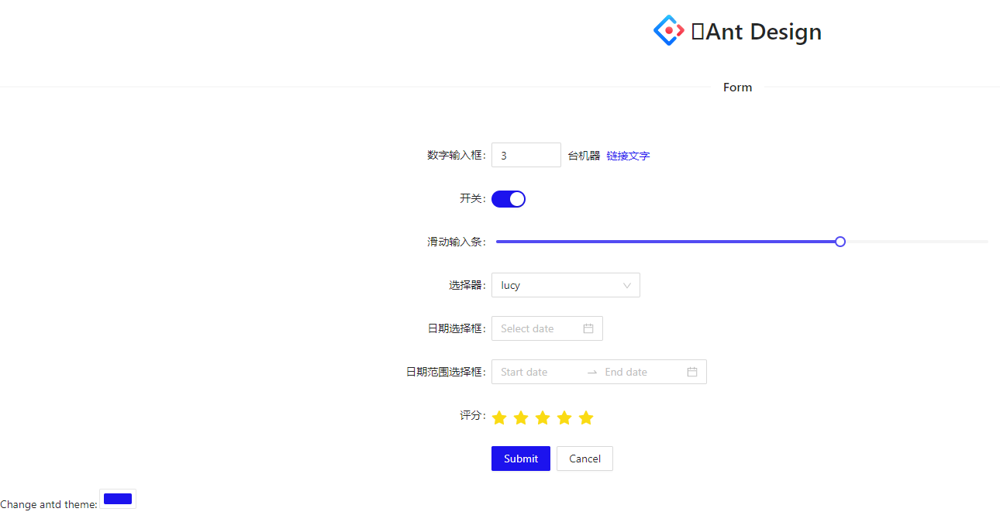

# 组件库

主应用和子应用都使用 [Ant Design v4](https://ant.design/)，保持统一的 UI 风格。

## Ant Design 介绍

antd 是基于 Ant Design 设计体系的 React UI 组件库，主要用于研发企业级中后台产品。

## Ant Design 特性

🌈 提炼自企业级中后台产品的交互语言和视觉风格。

📦 开箱即用的高质量 React 组件。

🛡 使用 TypeScript 开发，提供完整的类型定义文件。

⚙️ 全链路开发和设计工具体系。

🌍 数十个国际化语言支持。

🎨 深入每个细节的主题定制能力。

## Ant Design 安装

\$ npm install antd --save

或

\$ yarn add antd

## 浏览器引入 Ant Design

在浏览器中使用 script 和 link 标签直接引入文件，并使用全局变量 antd。

示例：

```js
import { DatePicker } from 'antd';

ReactDOM.render(<DatePicker />, mountNode);
```

引入样式：

```js
import 'antd/dist/antd.css'; // or 'antd/dist/antd.less'
```

按需加载：

antd 的 JS 代码默认支持基于 ES modules 的 tree shaking。

TypeScript：

antd 使用 TypeScript 进行书写并提供了完整的定义文件。（不要引用 @types/antd）。

## Ant Design 使用

简单例子参考文档： https://ant.design/docs/react/getting-started-cn

### 定制主题

方式一：

参考官方文档可以在 webpack、Umi、create-react-app 中定制主题。

参考文档： https://ant.design/docs/react/customize-theme-cn

方式二：

安装插件：

\$ npm install dynamic-antd-theme

这是一个动态更改蚂蚁设计主题的简单插件，无论是 less 还是 css。

用法：

在组件中导入：

```js
import DynamicAntdTheme from 'dynamic-antd-theme';

<div className='theme-container'>
	<span>Change antd theme: </span>
	<DynamicAntdTheme />
</div>;
```
效果如下所示，随着左边颜色的选择，主题颜色也随之改变：





### 多语言转换

antd 提供了一个 React 组件 ConfigProvider 用于全局配置国际化文案。

```js
import zhCN from 'antd/es/locale/zh_CN';

return (
  <ConfigProvider locale={zhCN}>
    <App />
  </ConfigProvider>
);
```

支持的语种和代号请查阅文档： https://ant.design/docs/react/i18n-cn