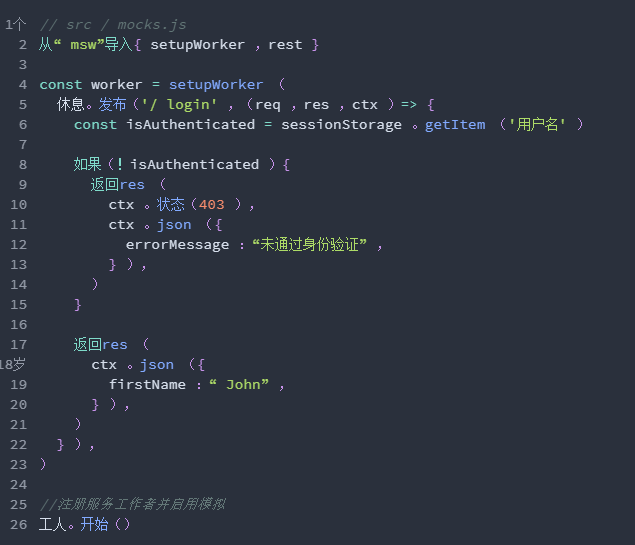
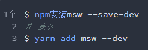
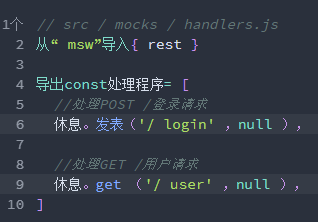
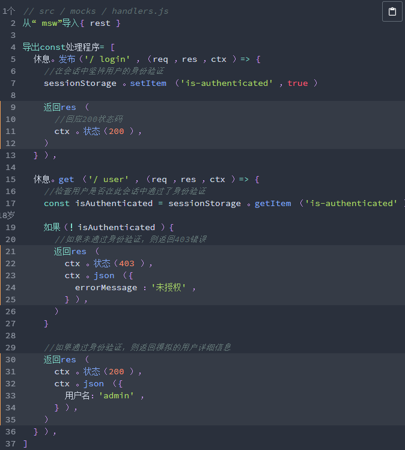
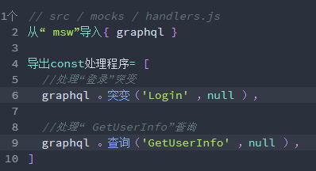
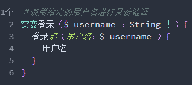
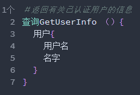
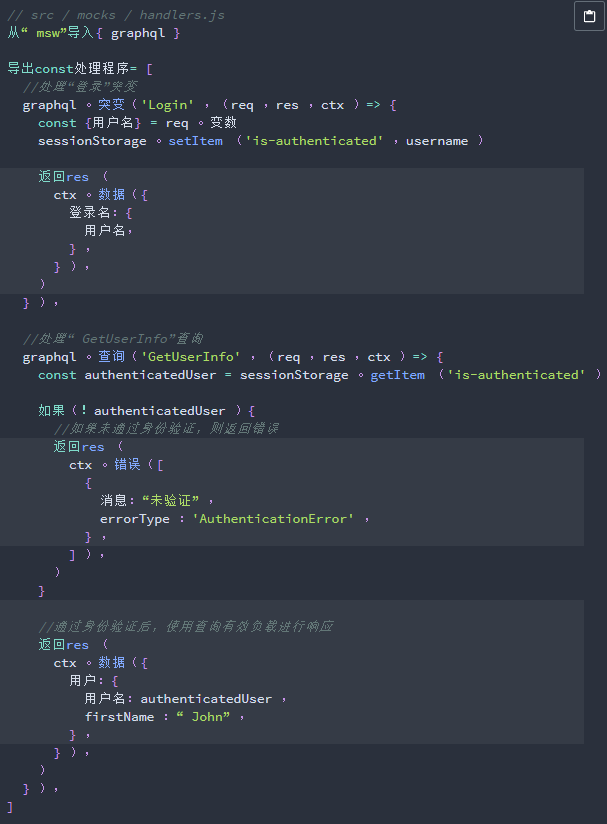
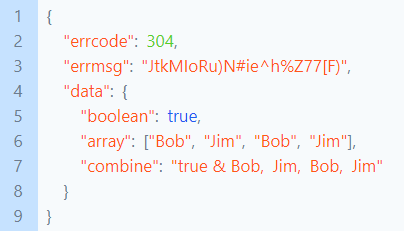

# 接口模拟

## msw介绍

Mock Service Worker是一个使用Service Worker API拦截实际请求的API模拟库。

由于Service Worker是所有现代浏览器附带的标准API。将Mock Service Worker集成到您的应用程序或测试设置中，不需要任何额外的配置，而是放置一个worker文件并声明模拟。

## msw的工作原理

借助Mock Service Worker，您可以使用声明式请求处理程序根据URL，RegExp或自定义条件捕获请求，并提供一个响应解析器函数，该函数返回模拟的响应。

这是模拟POST /login请求的模拟定义文件的示例：

## msw安装

在项目的根目录中运行以下命令：

## 模拟REST API

### 请求处理程序

要处理REST API请求，我们需要指定其method，path和一个将返回模拟响应的函数。

在本教程中，我们将为用户模拟基本的登录流程。此流程意味着处理两个请求：

POST /login，以允许我们的用户登录；

GET /user，以返回有关已登录用户的信息。

通过调用rest[METHOD]。

### 响应解析器

为了响应被拦截的请求，我们必须使用响应解析器函数指定模拟响应。

响应解析器是一个接受以下参数的函数：

req，有关匹配请求的信息；

res，用于创建模拟响应的功能实用程序；

ctx，一组有助于设置模拟响应的状态码，标题，正文等的函数。

提供对先前定义的请求处理程序的响应解析器：

## 模拟GraphQL API

### 请求处理程序

要处理GraphQL请求，我们需要指定其操作类型（查询/变异）。

在本教程中，我们将为用户模拟基本的登录流程。此流程意味着要处理两个操作：

Login 突变，以允许用户登录，

GetUserInfo 查询，以返回有关已登录用户的信息。

通过调用graphql[OPERATION_KIND]并提供操作名称来创建请求处理程序：

### 响应解析器

为了使用模拟响应来响应操作，我们必须使用响应解析器函数来指定它。

响应解析器是一个接受以下参数的函数：

req，有关匹配请求的信息；

res，用于创建模拟响应的功能实用程序；

ctx，一组有助于在模拟响应中设置状态代码，标头，数据等的函数。

在GraphQL中，我们在查询/变异声明本身中描述了预期的响应。让我们设计两个操作的响应形状：

提供对先前定义的请求处理程序的响应解析器：

## Mock介绍

Mock是一个高效、易用、功能强大的API管理平台，旨在为开发、产品、测试人员提供更优雅的接口管理服务。基于yapi二次开发，引入友互通单点登录，文档参考yapi官方文档即可。

### Mock规则

通过学习一些简单的 Mock 模板规则即可轻松编写接口，这将大大提高定义接口的效率，并且无需为编写 Mock 数据烦恼: 所有的数据都可以实时随机生成。

### 生成的Mock数据

生成的 Mock 数据可以直接用 ajax 请求使用，也可以通过服务器代理使用（不需要修改项目一行代码）。

## 相关文档

msw： https://github.com/mswjs/msw

Yapi官方文档： https://hellosean1025.github.io/yapi/documents/index.html