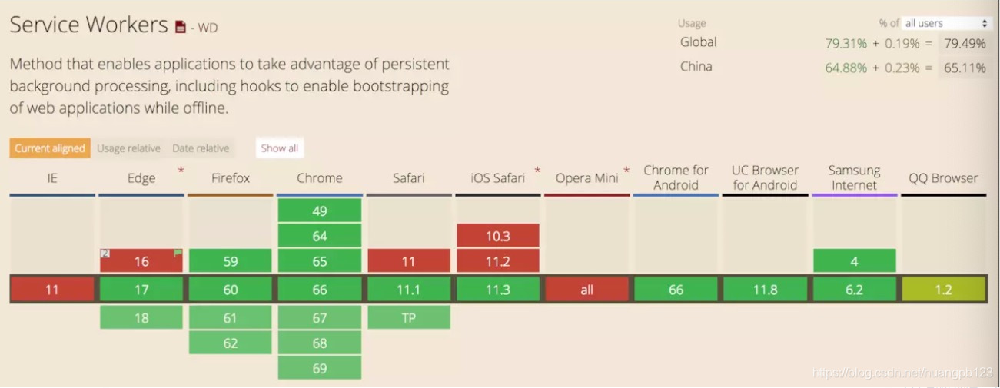

# 开发代理

## 代理是什么？

Proxy 也就是代理，可以帮助我们完成很多事情，例如对数据的处理，对构造函数的处理，对数据的验证，说白了，就是在我们访问对象前添加了一层拦截，可以过滤很多操作，而这些过滤，由你来定义。

## service worker

### service worker 是什么？

service worker 是一个服务器与浏览器之间的中间人角色，如果网站中注册了 service worker 那么它可以拦截当前网站所有的请求，进行判断（需要编写相应的判断程序），如果需要向服务器发起请求的就转给服务器，如果可以直接使用缓存的就直接返回缓存不再转给服务器，从而大大提高浏览体验。

### service worker 基本特征

· 无法操作DOM

· 只能使用HTTPS以及localhost

· 可以拦截全站请求从而控制你的应用

· 与主线程独立不会被阻塞（不要再应用加载时注册sw）

· 完全异步，无法使用XHR和localStorage

· 一旦被 install，就永远存在，除非被 uninstall或者dev模式手动删除

· 独立上下文

· 响应推送

· 后台同步

### service worker 生命周期

Install:

当主线程调用 navigator.serviceWorker.register 时，就会下载 Service Worker 的代码，如果 Service Worker 的代码中监听的 Install 事件，那么它会马上触发，而且 Install 事件只会触发一次。你可以利用 Install 事件来缓存页面中所需的资源，存到 CacheStorage 里面，然后通过返回 event.waitUntil() 的 Promise 来告诉浏览器什么时候安装完成了

Activate:

当安装完 Service Worker 时，就会触发 activate 事件，准备处理 push,sync 和 fetch 事件。但客户端（调用 register 的页面）仍然不受它控制。要第二次加载或者调用 clients.claim() 控制所有客户端时，它才具备处理以上事件的能力。

waiting:

触发了更新 Service Worker，新的 SW 就会进入 waiting 状态，这是因为确保浏览器只运行一个 Service Worker 版本。所以在所有客户端都关闭之前，都不会更新当前的 Service Worker。

### 浏览器的兼容性



### 注册安装

如果当前使用的浏览器支持 Service Worker ，则在 window.navigator 下会存在 serviceWorker 对象，我们可以使用这个对象的 register 方法来注册一个 Service Worker。

这里需要注意的一点是，Service Worker 在使用的过程中存在大量的 Promise， Service Worker 的注册方法返回的也是一个 Promise。

```js
// index.js
if ('serviceWorker' in window.navigator) {
  navigator.serviceWorker.register('./sw.js', { scope: './' })
    .then(function (reg) {
      console.log('success', reg);
    })
    .catch(function (err) {
      console.log('fail', err);
    });
}
```

register 方法返回一个 Promise。如果注册失败，可以通过 catch 来捕获错误信息；如果注册成功，可以使用 then 来获取一个 ServiceWorkerRegistration 的实例。

注册完 Service Worker 之后，浏览器会为我们自动安装它，因此我们就可以在 service worker 文件中监听它的 install 事件了。

```js
// sw.js
this.addEventListener('install', function (event) {
  console.log('Service Worker install');
});
```

同样的，Service Worker 在安装完成后会被激活，所以我们也可监听 activate 事件。

```js
// sw.js
this.addEventListener('activate', function (event) {
  console.log('Service Worker activate');
});
```

这时，我们可以在 Chorme 的开发者工具中看到我们注册的 Service Worker。

详细用法请阅读文档： https://blog.csdn.net/huangpb123/article/details/89498418