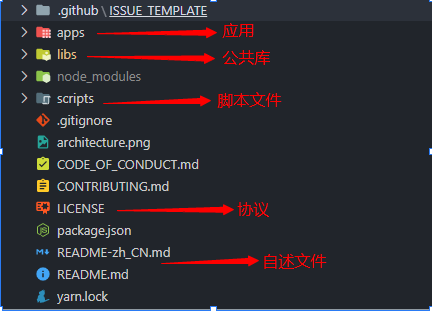
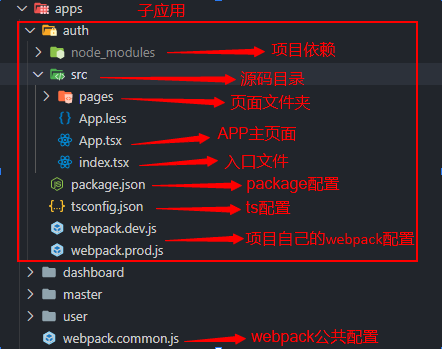
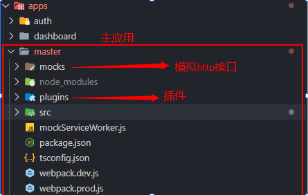
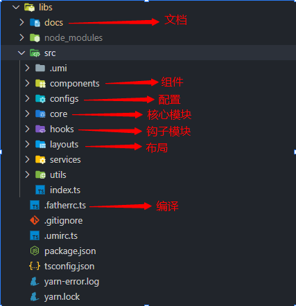

# 工作区

如下图所示，各个模块功能下面会详细介绍。

## apps

apps 是存放项目应用的地方，分为主应用和子应用。

子应用项目结构主要包括：

node_modules :项目所需依赖。

src :源码目录。

pages :页面文件，pages 中包含 App.less、App.tsx(App 主界面)和 index.tsx(入口文件)。

package.json :package 配置文件。

tsconfig.json :ts 配置文件。

webpack.dev.js、webpack.prod.js :项目中 webpack 的开发和生产版本。

如下图所示：

主应用项目相对于子应用项目多了一些模块：

mocks :用来模拟 http 协议接口。

plugins :插件模块。

如下图所示：

## libs

libs 是项目的公共库。

docs :存放文档，包括项目开发文档，资料描述等。

node_modules :项目所需依赖。

src 中包含 components(组件模块)，configs(系统配置)，core(核心模块)，hooks(钩子模块)等。

如下图所示:

