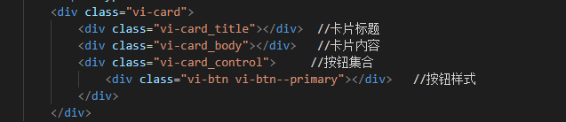
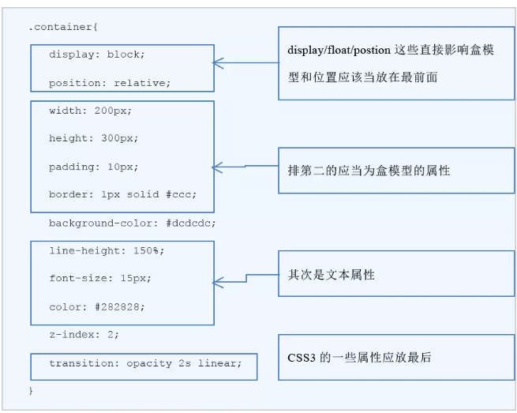

# 样式规范

## 常用的 CSS 类名

- 包裹类： container, wrapper, outer, inner, box, header, footer, main, content, aside, page, section, block

- 状态类： primary, secondary, success, danger, warning, info, error, Link, light, dark, disabled, active, checked, loading

- 尺寸类： large, middle, small, bigger, smaller

- 组件类： card, list, picture, carousel, swiper, menu, navs, badge, hint, modal, dialog

- 位置类： first, last, current, prev, next, forward, back

- 文本类： title, desc, content, date, author, category，label，tag

- 人物类： avatar, name, age, post, intro

## BEM

BEM(Block Element Modifier) 是一种命名 CSS class 的模式，使用这种模式可以让 CSS 代码更加利于维护。标准的 BEM 写法是 .block-name\_\_element-name--modifier-name。

vi 是命名前缀，vi-card 表示一个 block，vi-card*title，*表示 vi-card 下面的子元素 title,--表示修饰符，表示状态 vi-btn--primary 表示是普通按钮

## 属性的书写顺序

属性的书写顺序对于浏览器来说没有区别，除了优先级覆盖之外。但是如果顺序保持一致的话，扫一眼可以很快地知道这个选择器有什么类型的属性影响了它，所以一般要把比较重要的属性放前面。比较建议的顺序是这样的：

